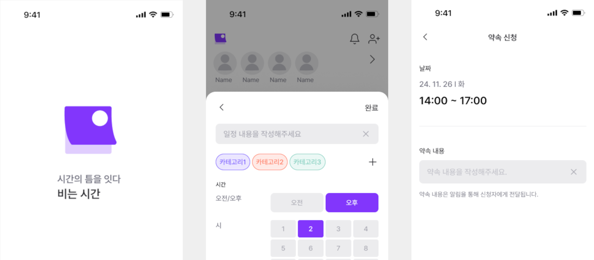
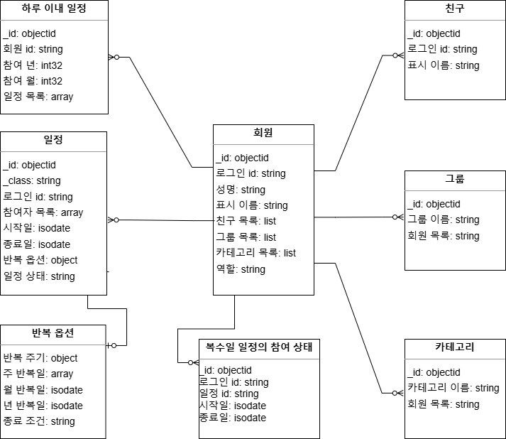

# 일정 관리 서비스

## 프로젝트 소개
- 일정을 기록하고
- 여럿이서 한 일정에 참여할 수 있는 서비스입니다.

## 프로젝트 기간
- 2024-11-21 ~ 2025-01-19

## 팀원 구성

|                                       **김시환**                                        |                                        **박성찬**                                         |
|:------------------------------------------------------------------------------------:|:--------------------------------------------------------------------------------------:|
|                                  앱 프로그래밍 및 인증 인가 구현                                  |                               일정 관리 로직 구현 및 쓰기 최적화                                |
|  |  |

## 다이어그램 

## 기술 스택 및 도구

|Category|             Technologies             |
|:------:|:------------------------------------:|
| Backend | Kotlin, Spring Boot, Spring Security |
| Database |               Mongodb                |
| Testing |                JUnit5                |
